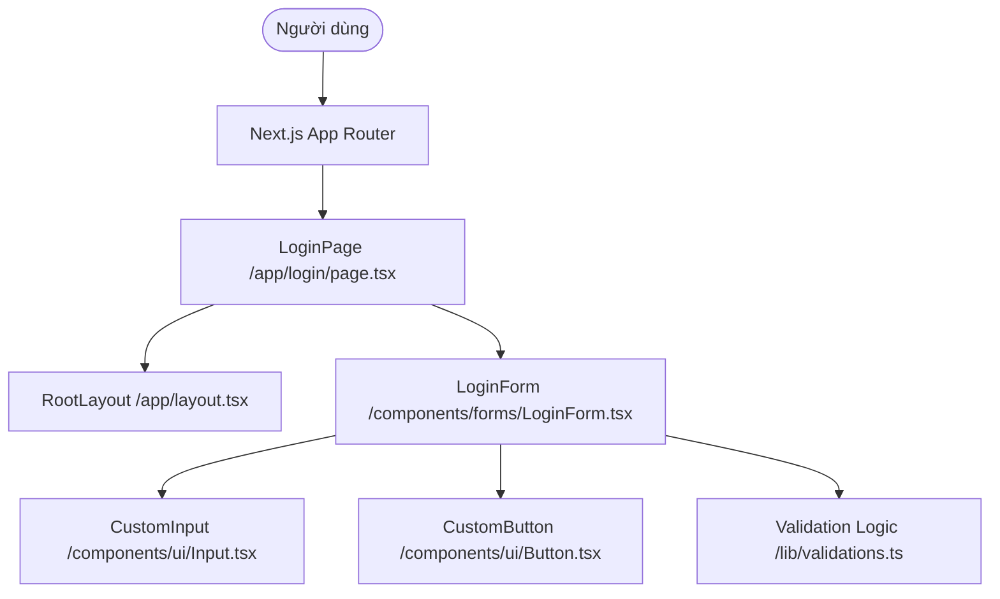
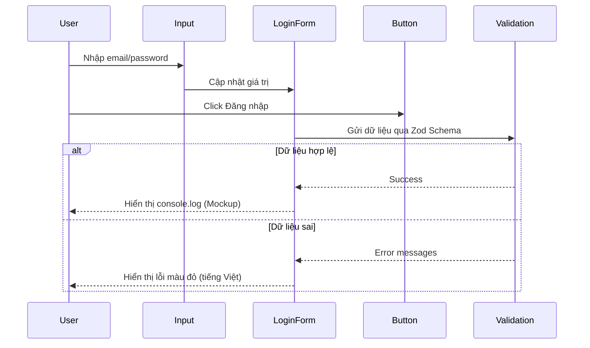

# System Design Document — Login Page
`research:arch-design-0001`
> Implements: `prd:tech-stack-0002`

## 1. Tổng quan kiến trúc
Chúng ta sử dụng kiến trúc **JAMstack** với **Next.js App Router**. Đây là kiến trúc tĩnh (Frontend Mockup) cho phép hiển thị nhanh chóng và giao tiếp qua cơ chế Props/Events của React.



## 2. Component Design
### 2.1 Cấu trúc thư mục (Chi tiết)
```
src/
├── app/              # Next.js Pages & Layouts
│   ├── login/        # /login route
│   │   └── page.tsx  # LoginPage component
│   └── layout.tsx    # Root layout
├── components/       # Reusable UI & Forms
│   ├── ui/           # Nguyên tử (Atoms): Input, Button, Label
│   └── forms/        # Phức hợp (Molecules): LoginForm
├── lib/              # Logic & Utilities
│   └── validations.ts# Zod/Custom Validation schemas
├── styles/           # Global Tailwind CSS styles
└── types/            # TypeScript Interface definitions
```

### 2.2 Component Interface
| Component | Props | State | Events |
|-----------|-------|-------|--------|
| `LoginPage` | — | — | — |
| `LoginForm` | — | `formData`, `errors` | `onSubmit` |
| `CustomInput`| `label`, `type`, `error` | `value` | `onChange`, `onBlur` |
| `CustomButton`| `text`, `isLoading` | — | `onClick` |

## 3. Data Flow
Chúng ta sử dụng **Uncontrolled Components** (hoặc React Hook Form) kết hợp với **Zod** để xử lý validation logic một cách tập trung.



## 4. Quy ước kỹ thuật (Conventions)
- **File Naming:** kebab-case (ví dụ: `login-form.tsx`).
- **Styling:** CSS utility-first (Tailwind). Colors: chuẩn slate-900 (text), blue-600 (primary button).
- **Validation:** Sử dụng Zod để định nghĩa schema và hiển thị lỗi tiếng Việt.
- **a11y:** Sử dụng semantic tags (form, label, button type="submit").

## 5. Rủi ro kỹ thuật
| # | Rủi ro | Impact | Likelihood | Mitigation |
|---|--------|--------|------------|------------|
| 1 | Cấu trúc Next.js App Router mới | Medium | Low | Đọc kỹ docs và dùng pattern chuẩn. |
| 2 | Tailwind CSS v4 (nếu dùng) | Low | Low | Dùng v3 ổn định nếu cần. |

## 6. Danh mục Technology Stack
| Layer | Technology | Version | Lý do chọn |
|-------|------------|---------|------------|
| Framework | Next.js | 14/15 (Latest) | Tiêu chuẩn ngành, App Router mạnh mẽ. |
| Styling | Tailwind CSS | Latest | UX mượt mà, phát triển nhanh. |
| Validation | React Hook Form + Zod | Latest | Quản lý form hiệu quả, type-safe. |
