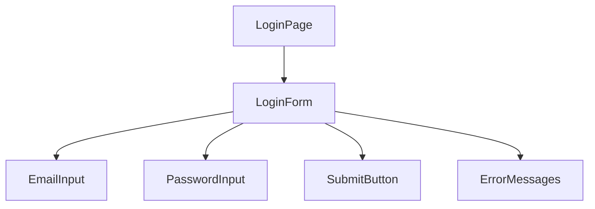

# System Design Document
`research:arch-design-0001`
> Implements: `prd:tech-stack-0002`

## 1. Tổng quan kiến trúc
Kiểu kiến trúc được chọn là **Frontend Mockup (JAMstack)**, tập trung vào xây dựng giao diện UI/UX theo yêu cầu của PRD mà không có backend logic phức tạp.

## 2. Component Design
### 2.1 Cấu trúc thư mục
Tổ chức code theo cấu trúc sau:
```
src/
├── app/              # Next.js App Router pages
│   ├── login/        # Login page mockup
│   └── layout.tsx    # Root layout with Tailwind CSS config
├── components/       # Reusable UI components
│   ├── ui/           # Atomic UI (Button, Input, etc.)
│   └── forms/        # Composite form components (LoginForm.tsx)
├── lib/              # Utilities, helpers
├── hooks/            # Custom React hooks (useFormValidation)
└── types/            # TypeScript type definitions
```

### 2.2 Component Diagram (Mermaid)


### 2.3 Component Interface
| Component | Props | State | Events |
|-----------|-------|-------|--------|
| `LoginForm` | None | `formErrors, isSubmitting` | `onSubmit` |
| `InputField` | `label, type, name, error` | `value` | `onChange` |
| `Button` | `label, variant, onClick` | None | `onClick` |

## 3. Data Flow
Luồng dữ liệu trong form:
1. User nhập liệu vào `InputField`.
2. `LoginForm` cập nhật State (hoặc dùng React Hook Form).
3. Khi User nhấn Nút Đăng nhập:
   - Thực hiện Validation logic.
   - Nếu có lỗi -> Cập nhật `formErrors` -> Hiển thị thông báo.
   - Nếu thành công -> Alert "Submit thành công" (Vì chưa có Backend).

## 4. Quy ước kỹ thuật
- **Coding Standards:** Chia nhỏ component, sử dụng Functional components & Hooks.
- **Error Handling:** Validate trực tiếp trên Client bằng Regex.
- **Responsive:** Mobile-first, font size linh hoạt.
- **a11y:** Semantic HTML labels, input roles.

## 5. Rủi ro kỹ thuật
| # | Rủi ro | Impact | Likelihood | Mitigation |
|---|--------|--------|------------|------------|
| 1 | Logic validation phức tạp | Medium | Low | Sử dụng Zod hoặc Yup để đơn giản hóa. |

## 6. Danh mục Technology Stack
| Layer | Technology | Version | Lý do chọn |
|-------|------------|---------|------------|
| Framework | Next.js | Mới nhất | Tối ưu SEO, App Router hiện đại. |
| Styling | Tailwind CSS | Mới nhất | Xây dựng giao diện nhanh. |
| Icons | Lucide React | Mới nhất | Icon đa dạng, bộ thư viện đẹp. |
