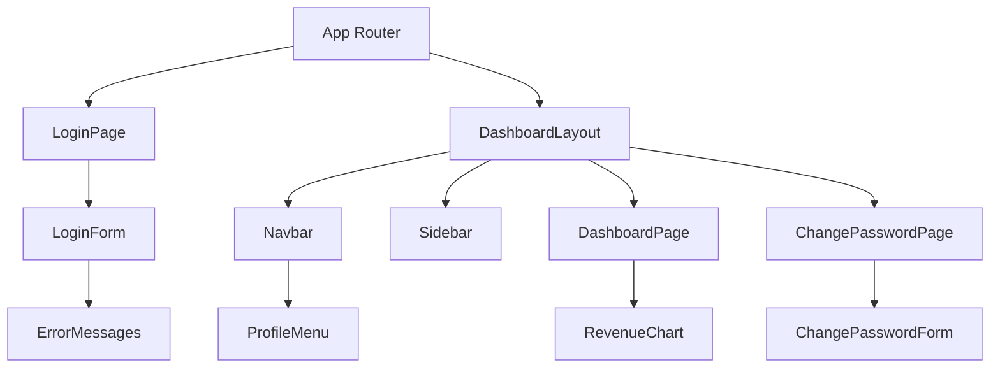

# System Design Document
`research:arch-design-0001`
> Implements: `prd:tech-stack-0002`

## 1. Tổng quan kiến trúc
Kiểu kiến trúc được chọn là **Frontend Mockup (JAMstack)**, tập trung vào xây dựng giao diện UI/UX theo yêu cầu của PRD mà không có backend logic phức tạp. Ứng dụng giả lập (mock) toàn bộ luồng Auth và Data.

## 2. Component Design
### 2.1 Cấu trúc thư mục source code
Tổ chức code theo Next.js App Router (thư mục `src/`):
```
src/
├── app/                      # Phân nhánh theo Next.js App Router logic
│   ├── login/                # Login page mockup
│   ├── dashboard/            # Nhánh chính sau đăng nhập
│   │   ├── change-password/  # Trang đổi mật khẩu
│   │   └── page.tsx          # Trang chủ Dashboard (Mock Chart)
│   └── layout.tsx            # Root layout chung cấu hình Tailwind CSS
├── components/               # Cấu trúc Component dùng lại
│   ├── ui/                   # Các component cơ bản mức Atomic
│   ├── layout/               # Các phần chung layout: Navbar, Profil Menu, Sidebar
│   ├── forms/                # Form đăng nhập, form đổi mật khẩu
│   └── dashboard/            # Component đặc tả hiển thị chức năng trong Dashboard
├── lib/                      # Hàm tiện ích chung (Utilities)
│   └── mock-data.ts          # Giả lập dữ liệu mock cho danh sách doanh thu
├── hooks/                    # Custom hooks
└── types/                    # Định nghĩa types của TypeScript
```

### 2.2 Component/Module Diagram (Mermaid)


### 2.3 Interface/Contract
| Module/Component | Public API / Interface | Dependencies |
|------------------|----------------------|--------------|
| `LoginForm` | `formErrors, isSubmitting` state xử lý đăng nhập | `lucide-react` |
| `ProfileMenu` | `user` data hiển thị thông tin | `lucide-react` |
| `ChangePasswordForm` | `onSubmit` logic đổi MK giả lập | Validate local hook |
| `RevenueChart` | `data` đồ thị doanh thu mock | `Recharts` |

## 3. Data Flow
Mô tả luồng dữ liệu (App Mockup flow):
1. User nhập liệu `Email` và `Password` trên `LoginForm`. Validate -> ấn Submit -> Fake Redirect qua `/dashboard`.
2. Truy cập `/dashboard` -> UI render `Navbar` (có chứa `ProfileMenu`), `Sidebar`, và tải mock data doanh thu từ `lib/mock-data.ts`.
3. Biểu đồ `RevenueChart` đọc data và hiển thị biểu đồ 7 ngày từ `Recharts`.
4. User click `ProfileMenu` -> click "Đổi mật khẩu" chuyển sang route `/dashboard/change-password`.
5. Trong form đổi mật khẩu, validate cục bộ hiện lên tại chỗ nếu lỗi hoặc đúng -> hiện thông báo và fake redirect.

## 4. Quy ước kỹ thuật
- **Coding Standards:** Functional components, Custom hooks, chia nhỏ logic.
- **Error Handling:** Validate form inline sử dụng Regex hoặc state local, báo lỗi tiếng Việt màu đỏ dưới ô nhập.
- **Quy ước đặc thù UI:** Framework Tailwind CSS với tone màu Light Mode chủ đạo. Hỗ trợ responsive Mobile-first căn bản. Biểu đồ chỉ fix cứng 7 ngày mặc định.

## 5. Rủi ro kỹ thuật
| # | Rủi ro | Impact | Likelihood | Mitigation |
|---|--------|--------|------------|------------|
| 1 | Logic validation phức tạp (do thiếu thư viện) | Medium | Medium | Nếu form mở rộng phức tạp, cài Zod / React Hook Form. |
| 2 | Giới hạn tuỳ biến của Chart library | Low | Low | Dùng tính năng cơ bản của Recharts, không yêu cầu animation phức tạp. |

## 6. Danh mục Technology Stack
| Layer | Technology | Version | Lý do chọn |
|-------|------------|---------|------------|
| Language | TypeScript | Mới nhất | Typing strong code React. |
| Framework | Next.js | Mới nhất (App Router) | Routing chuẩn và tính linh hoạt frontend. |
| Styling/UI | Tailwind CSS | Mới nhất | Tốc độ dựng form chuyên nghiệp nhanh. |
| Chart Library | Recharts | Mới nhất | Cấu trúc native React dùng trực quan, nhẹ nhàng. |
| Icons | Lucide React | Mới nhất | Kho icon SVG đẹp. |
